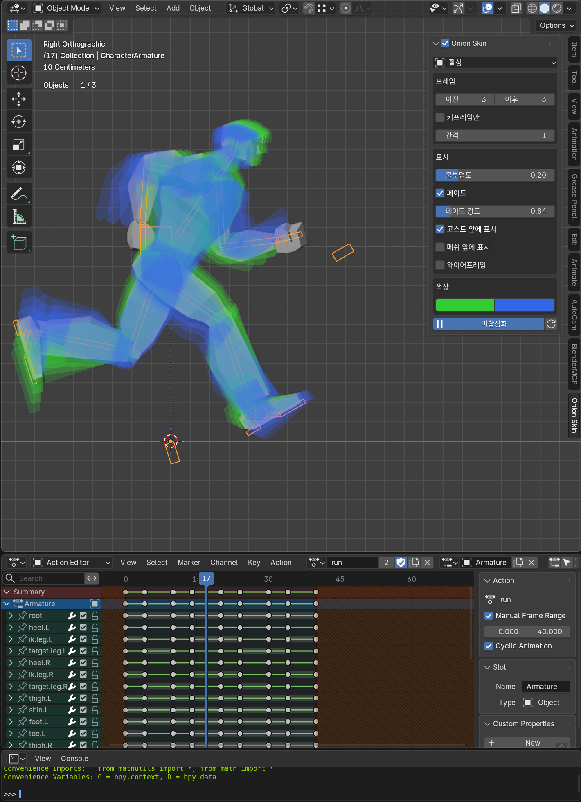
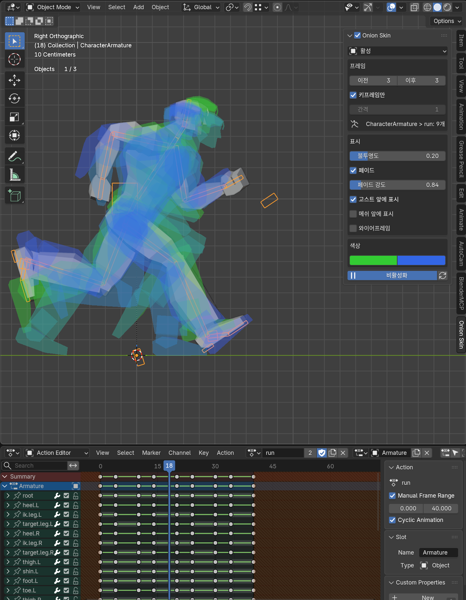
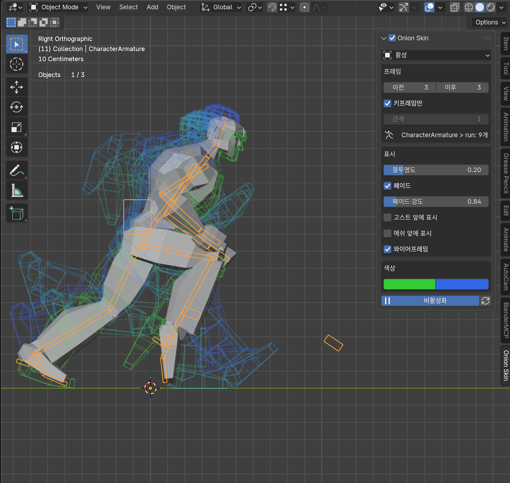
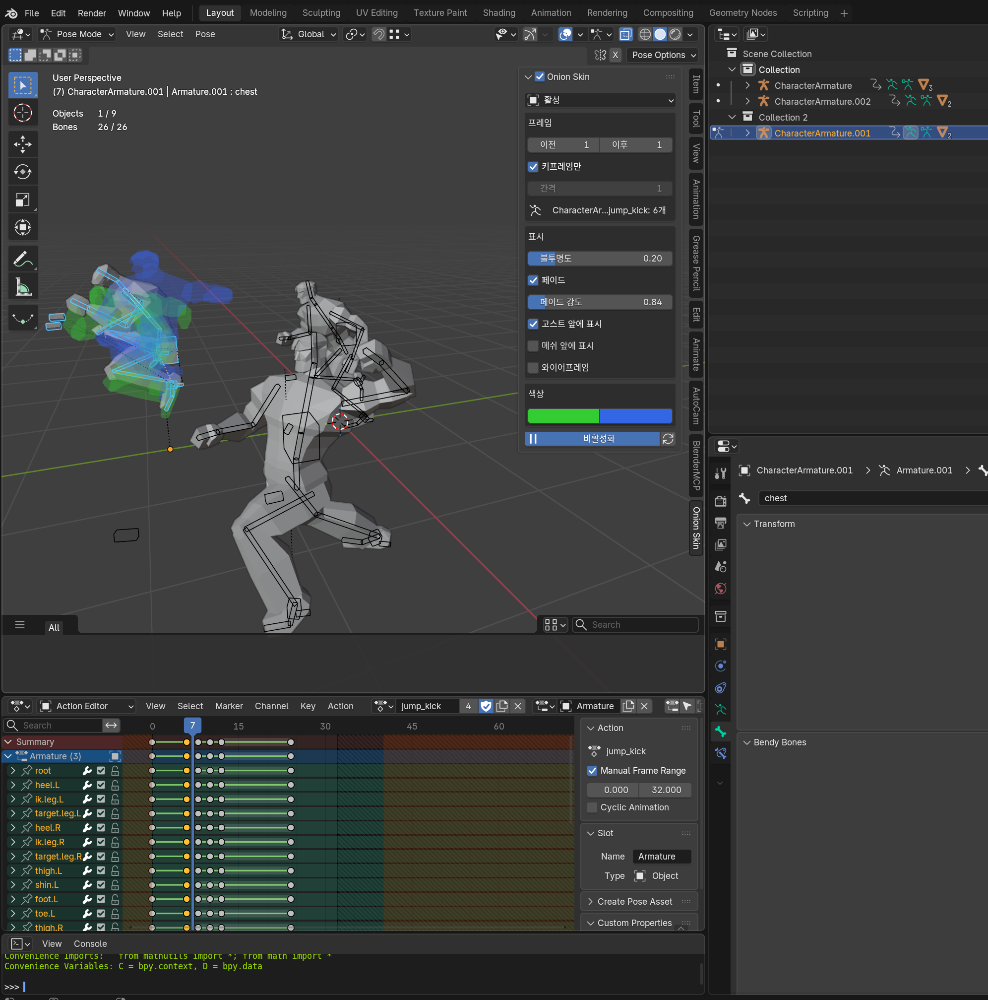
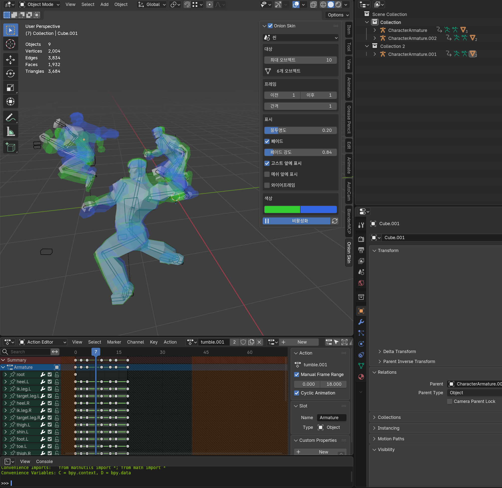
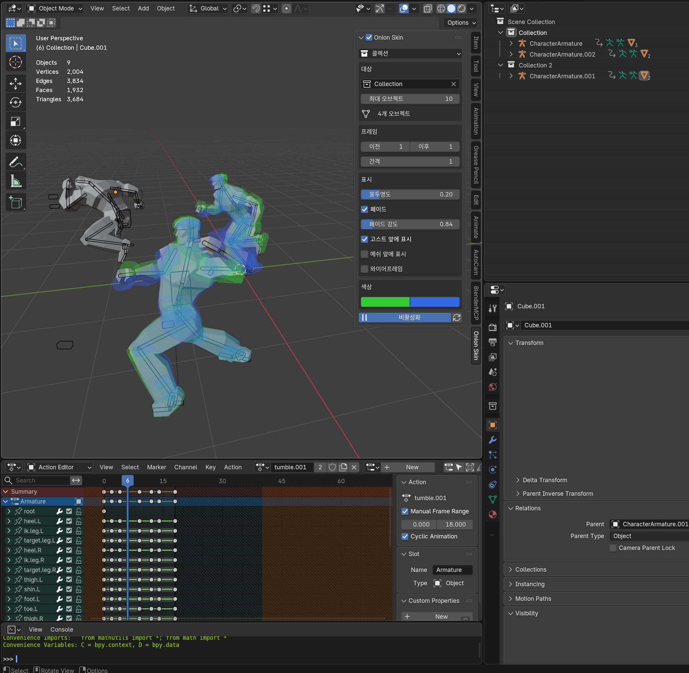

# Mesh Onion Skin

Blender 5.0+ 용 어니언 스킨 애드온 — 애니메이션 작업 중 이전/이후 포즈를 고스트로 겹쳐 볼 수 있습니다.

> **[English README](README.md)**

|전체 프레임|키프레임만|와이어프레임|
|:-:|:-:|:-:|
||||

|Active 모드|Scene 모드|Collection 모드|
|:-:|:-:|:-:|
||||

## 기능

- **3가지 대상 모드** — 활성(단일 오브젝트), 씬(전체 애니메이션 메시), 콜렉션(특정 그룹)
- **빠른 GPU 렌더링** — 고스트를 GPU에서 직접 그려서 애니메이션 재생이 부드럽게 유지됨
- **키프레임 모드** — 키프레임 위치에만 고스트 표시 (Active 모드 전용)
- **스마트 캐싱** — 실제로 변경된 프레임만 다시 계산하여 타임라인 스크럽이 빠름
- **프레임-우선 베이킹** — 다중 오브젝트 모드에서 프레임당 한 번만 점프하여 모든 오브젝트를 처리
- **페이드** — 현재 프레임에서 멀어질수록 고스트가 투명해지며, 감쇠 정도 조절 가능
- **와이어프레임 모드** — 고스트를 윤곽선으로 표시하여 현재 포즈를 가리지 않음
- **앞에 표시** — 고스트 또는 메쉬를 씬의 다른 오브젝트 위에 그리기 (택1)
- **이전/이후 색상** — 과거 고스트와 미래 고스트의 색상을 각각 설정
- **Blender 5.0 지원** — 새로운 레이어드 액션 시스템과 이전 버전 모두 호환

## 요구 사항

- Blender **5.0** 이상

## 설치

1. 원하는 언어의 `.py` 파일을 다운로드:
   | 파일 | 언어 |
   |------|------|
   | `mesh_onion_skin_en.py` | English |
   | `mesh_onion_skin_kr.py` | 한국어 |

2. Blender에서: **편집 > 환경설정 > 애드온 > 설치**
3. 다운로드한 파일을 선택하고 애드온을 활성화
4. **뷰3D > 사이드바(N) > Onion Skin** 탭에 패널이 나타남

## 사용법

1. **메시** 또는 부모 **아마추어**를 선택
2. **Onion Skin** 사이드바 탭에서 **활성화** 체크
3. 드롭다운에서 **모드**를 선택:
   - **활성** — 선택된 오브젝트만 고스트 표시
   - **씬** — 씬 내 모든 보이는 애니메이션 메시에 고스트 표시
   - **콜렉션** — 지정한 콜렉션의 보이는 애니메이션 메시에 고스트 표시
4. 애니메이션을 재생하거나 타임라인을 스크럽하면 고스트가 자동으로 나타남

> **콜렉션 모드 참고:** 아마추어와 소속 메시가 **같은 콜렉션**에 있어야 합니다. 메시가 콜렉션 A에, 아마추어가 콜렉션 B에 있으면 콜렉션 A로 필터할 때 고스트가 나타납니다 (메시가 있는 쪽).

### 패널 옵션

| 옵션 | 설명 |
|------|------|
| **모드** | 대상 모드 — 활성, 씬, 콜렉션 |
| **콜렉션** | 대상 콜렉션 (콜렉션 모드에서만) |
| **최대 오브젝트** | 처리할 최대 오브젝트 수 (씬/콜렉션 모드) |
| **이전 / 이후** | 현재 프레임 기준으로 앞뒤에 표시할 고스트 수 |
| **키프레임만** | 키프레임 위치에만 고스트 표시 (Active 모드 전용) |
| **간격** | 고스트 사이의 프레임 간격 |
| **불투명도** | 고스트의 투명한 정도 |
| **페이드** | 현재 프레임에서 먼 고스트를 더 투명하게 |
| **페이드 강도** | 페이드 효과가 얼마나 빠르게 떨어지는지 |
| **앞에 표시** | 없음 / 고스트 (고스트를 앞에) / 메쉬 (메쉬를 앞에) |
| **와이어프레임** | 고스트를 윤곽선으로 표시 |
| **이전 / 이후 색상** | 과거/미래 고스트 색상 |

## 라이선스

MIT
