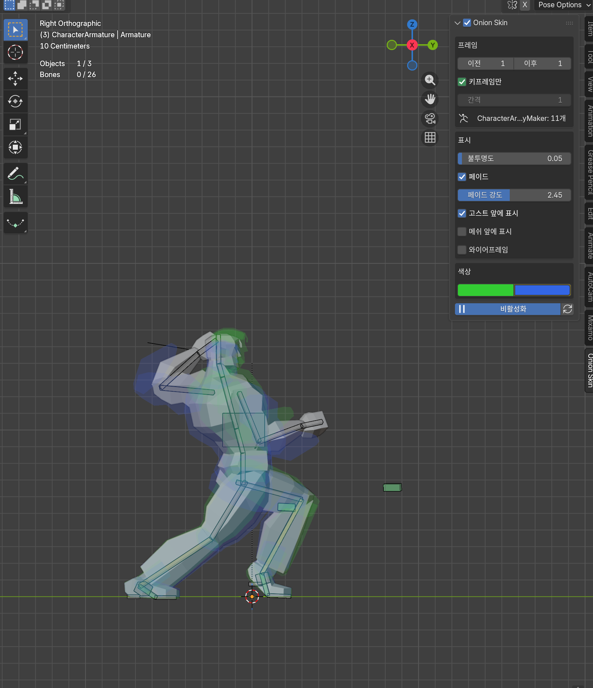
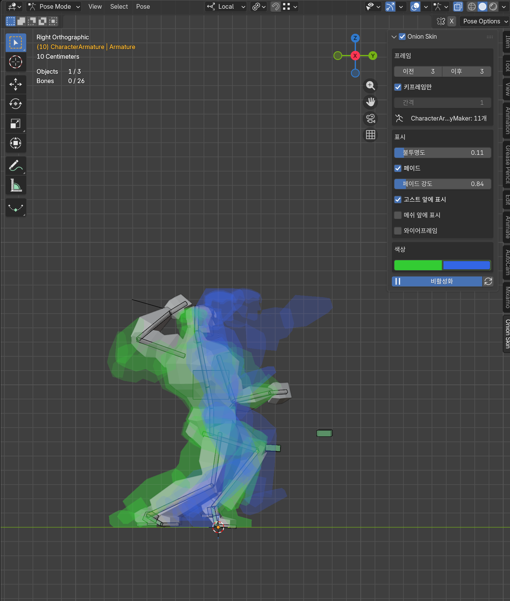
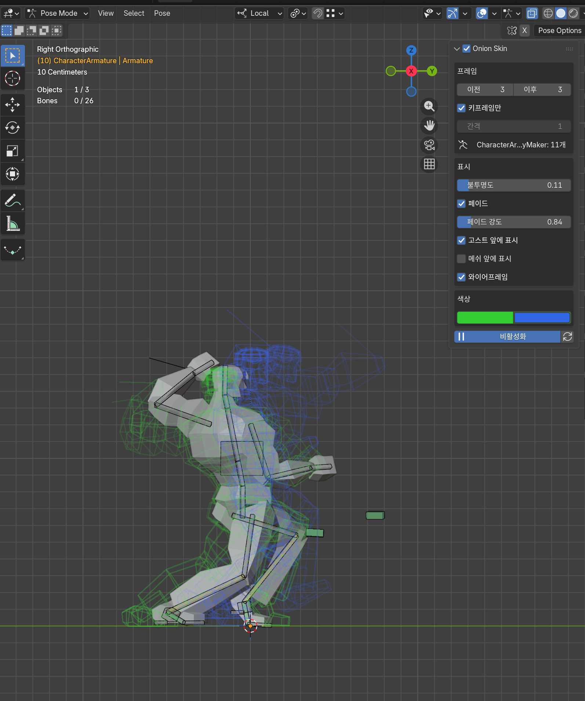

# Mesh Onion Skin

Blender 5.0+ 용 GPU 기반 3D 메시 애니메이션 어니언 스킨 애드온.

> **[English README](README.md)**

## 기능

- **GPU 가속 렌더링** — `gpu` 모듈 배치로 고스트 메시를 전부 GPU에서 그려 CPU 오버헤드가 거의 없음
- **키프레임 인식 모드** — 고정 간격 대신 아마추어의 실제 키프레임 위치에 고스트를 표시하여 포즈 확인이 정확함
- **증분 캐시** — 변경된 프레임만 다시 베이크하여, 복잡한 메시에서도 타임라인 스크럽이 빠르게 유지됨
- **페이드 감쇠** — 현재 프레임과의 시간 거리에 따라 고스트 불투명도가 감소하며, 커브 강도 조절 가능
- **와이어프레임 모드** — 현재 포즈를 가리지 않도록 고스트를 엣지 와이어프레임으로 표시
- **앞에 표시 옵션** — 고스트와 메시 각각에 독립적인 깊이 오버라이드를 설정하여 씬 지오메트리 위에 렌더링 가능
- **이전/이후 색상** — 과거 고스트와 미래 고스트의 색상을 별도로 설정
- **Blender 5.0 레이어드 액션 지원** — 새로운 레이어드 액션 시스템 완전 지원 + 레거시 폴백

|키프레임 모드|와이어프레임 모드|
|:-:|:-:|
|||

## 요구 사항

- Blender **5.0** 이상

## 설치

1. 원하는 언어의 `.py` 파일을 다운로드:
   | 파일 | 언어 |
   |------|------|
   | `mesh_onion_skin_en.py` | English |
   | `mesh_onion_skin_kr.py` | 한국어 |

2. Blender에서: **편집 > 환경설정 > 애드온 > 설치**
3. 다운로드한 파일을 선택하고 애드온을 활성화
4. **뷰3D > 사이드바(N) > Onion Skin** 탭에 패널이 나타남

## 사용법

1. **메시** 오브젝트 또는 부모 **아마추어**를 선택
2. **Onion Skin** 사이드바 탭에서 **활성화** 체크
3. 애니메이션을 재생하거나 타임라인을 스크럽하면 고스트가 자동 업데이트됨

### 패널 옵션

| 옵션 | 설명 |
|------|------|
| **이전 / 이후** | 현재 프레임 기준 이전/이후 고스트 프레임 수 |
| **키프레임만** | 아마추어 키프레임 위치에만 고스트 표시 |
| **간격** | 고스트 간 프레임 간격 (키프레임 모드 비활성 시) |
| **불투명도** | 전체 고스트 투명도 |
| **페이드** | 시간 거리에 따른 불투명도 감쇠 활성화 |
| **페이드 강도** | 페이드 커브 강도 |
| **고스트 앞에 표시** | 모든 씬 지오메트리 위에 고스트 그리기 |
| **메시 앞에 표시** | 오브젝트의 `show_in_front` 속성 설정 |
| **와이어프레임** | 고스트를 와이어프레임 엣지로 렌더링 |
| **이전 / 이후 색상** | 과거/미래 고스트 그룹별 색상 |

## 라이선스

MIT
